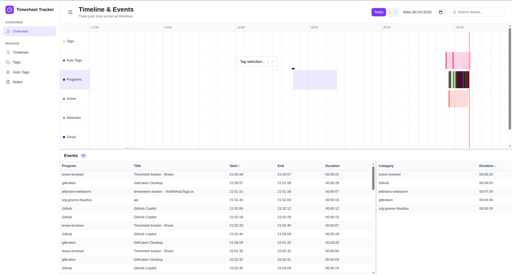

# Timesheets Tracker

Keep track of your activities during the day. Use activities like:
* Open programs
* Websites
* Git commits
* Calendar events
* Active / locked computer status
* Productive.io planned hours

Configure auto tags, to automatically tag activity for a specific customer or project.
View a summed overview of tagged hours for the day
Get basic pivot table style reports of:
* taged time per day/week/month/year
* most used programs
* work day start and end times
* average work day duration
* ...

This program is in alpha stage. Expect bugs and report them to make the application better.



# Install

[](https://bertyhell.github.io/timesheets-tracker/)

Or grab a specific build from the [Releases page](../../releases).

## macOS

This app is not code-signed or notarized — that requires a paid Apple Developer account, which this open-source project doesn't have. On first launch, macOS will say:

> "Timesheets Tracker.app" is damaged and can't be opened. You should move it to the Bin

This isn't actual damage — it's Gatekeeper blocking an unsigned, unnotarized app that was downloaded from the internet. To fix it, run this once in Terminal:

```shell
xattr -cr "/Applications/Timesheets Tracker.app"
```

Then open the app normally.

If that command fails with `Operation not permitted`, your terminal app needs Full Disk Access: System Settings → Privacy & Security → Full Disk Access → enable it for your terminal app (Terminal, iTerm, etc.), then fully quit and reopen the terminal and try the command again.

Still TODO:

- add option to add tags
- add export options
- add install service for linux/mac

# Build

## Build first time

```shell
npm run build-service-script
npm run copy-database
npm run build
```

## Build during development

```shell
npm run build
```

# Development

Install chrome extension in Chrome:
"load unpacked" => folder chrome-extension

```shell
cd api && npm run dev
cd ../client && npm run dev
```

Frontend:
http://localhost:55588

Backend:
http://localhost:55577

Backend Swagger docs
http://localhost:55577/docs
