# Timesheets Tracker — Architecture

```mermaid
flowchart TB

  subgraph EXT["Chrome Extension"]
    EXTBG["background.js<br/>chrome.tabs.onUpdated / onActivated / onHighlighted"]
  end

  subgraph FE["React Frontend (client/src)"]
    FAPP["App.tsx<br/>layout + sidebar nav"]
    FTIMELINES["TimelinesAndEventsPage<br/>(overview page)<br/>+ EditTagModal / BulkTagModal"]
    FOVERVIEWS["OverviewsPage<br/>OverviewView / EditOverviewConfigModal"]
    subgraph FSETTINGSGRP["Settings"]
      FSETTINGS["SettingsPage"]
      FGENERAL["GeneralSettingsPage<br/>Move/SwitchDatabaseModal"]
      FINTEGR["IntegrationsPage"]
      FPRODUCTIVE["ProductiveSettingsPage"]
    end
    subgraph FMANAGEGRP["Manage"]
      FMTIMELINES["TimelinesPage<br/>EditTimelineModal"]
      FAUTOTAGS["AutoTagsPage<br/>EditAutoTagModal"]
      FTAGNAMES["TagNamesPage<br/>EditTagNameModal"]
      FNOTES["NotesPage<br/>EditAutoNoteModal"]
    end
  end

  subgraph LISTENERS["Listeners &amp; Schedulers"]
    LPROGRAMS["ProgramsListener<br/>OnApplicationBootstrap → OS window listener"]
    LACTIVESTATES["ActiveStatesListener<br/>@Interval 120s idle poll"]
    LPURGE["PurgeOldEventsListener<br/>@Cron EVERY_DAY_AT_MIDNIGHT"]
  end

  subgraph BE["NestJS Backend (api/src)"]
    BAPPMOD["AppModule<br/>+ ServeStaticModule (serves client build)<br/>+ ScheduleModule"]
    BPROGRAMS["ProgramsModule"]
    BACTIVESTATES["ActiveStatesModule"]
    BDATABASE["DatabaseModule"]
    BSEED["SeedModule"]
    BTAGS["TagsModule"]
    BTAGNAMES["TagNamesModule"]
    BAUTOTAGS["AutoTagsModule"]
    BWEBSITES["WebsitesModule"]
    BAUTONOTES["AutoNotesModule"]
    BCALENDARS["CalendarsModule"]
    BTIMELINES["TimelinesModule"]
    BSETTINGS["SettingsModule"]
    BOVERVIEWS["OverviewsModule"]
    BINTEGRATIONS["IntegrationsModule"]
    BPRODUCTIVE["ProductiveModule"]
    BGITCOMMITS["GitCommitsModule"]
  end

  DB[("SQLite DB<br/>node:sqlite DatabaseSync")]

  %% Chrome extension feeds API directly
  EXTBG -->|"POST /api/websites"| BWEBSITES

  %% Frontend nav structure
  FAPP --> FTIMELINES
  FAPP --> FOVERVIEWS
  FAPP --> FSETTINGS
  FAPP --> FMTIMELINES
  FAPP --> FAUTOTAGS
  FAPP --> FTAGNAMES
  FAPP --> FNOTES
  FSETTINGS --> FGENERAL
  FSETTINGS --> FINTEGR
  FINTEGR --> FPRODUCTIVE
  FSETTINGSGRP ~~~ FMANAGEGRP

  %% Frontend -> Backend REST calls (generated OpenAPI SDK)
  FTIMELINES -->|REST| BTIMELINES
  FTIMELINES -->|REST| BTAGS
  FOVERVIEWS -->|REST| BOVERVIEWS
  FGENERAL -->|REST| BSETTINGS
  FINTEGR -->|REST| BINTEGRATIONS
  FPRODUCTIVE -->|REST| BPRODUCTIVE
  FMTIMELINES -->|REST| BTIMELINES
  FAUTOTAGS -->|REST| BAUTOTAGS
  FTAGNAMES -->|REST| BTAGNAMES
  FNOTES -->|REST| BAUTONOTES

  %% Backend module composition (AppModule imports)
  BAPPMOD --> BPROGRAMS
  BAPPMOD --> BACTIVESTATES
  BAPPMOD --> BDATABASE
  BAPPMOD --> BTAGS
  BAPPMOD --> BTAGNAMES
  BAPPMOD --> BAUTOTAGS
  BAPPMOD --> BWEBSITES
  BAPPMOD --> BAUTONOTES
  BAPPMOD --> BCALENDARS
  BAPPMOD --> BTIMELINES
  BAPPMOD --> BSETTINGS
  BAPPMOD --> BOVERVIEWS
  BAPPMOD --> BINTEGRATIONS
  BAPPMOD --> BPRODUCTIVE
  BAPPMOD --> BGITCOMMITS

  BDATABASE --> BSEED
  BPRODUCTIVE --> BINTEGRATIONS

  %% TimelinesModule aggregates events from other modules
  BTIMELINES --> BPROGRAMS
  BTIMELINES --> BWEBSITES
  BTIMELINES --> BACTIVESTATES
  BTIMELINES --> BTAGS
  BTIMELINES --> BAUTOTAGS
  BTIMELINES --> BCALENDARS
  BTIMELINES --> BGITCOMMITS

  %% Listeners live inside their modules
  BPROGRAMS -.-> LPROGRAMS
  BACTIVESTATES -.-> LACTIVESTATES
  BSETTINGS -.-> LPURGE

  %% All backend modules persist through DatabaseModule
  BDATABASE --> DB
```

**Legend**
- Solid arrows = direct calls / imports / REST requests
- Dotted arrows = listener/module composition relationships
- `TimelinesAndEventsPage` is the app's **overview page** (default route `/`); `OverviewsPage` is a separate reporting/analysis page with saved configs
- `TimelinesModule` aggregates raw events from Programs, Websites, ActiveStates, Tags, AutoTags, Calendars and GitCommits into unified timelines